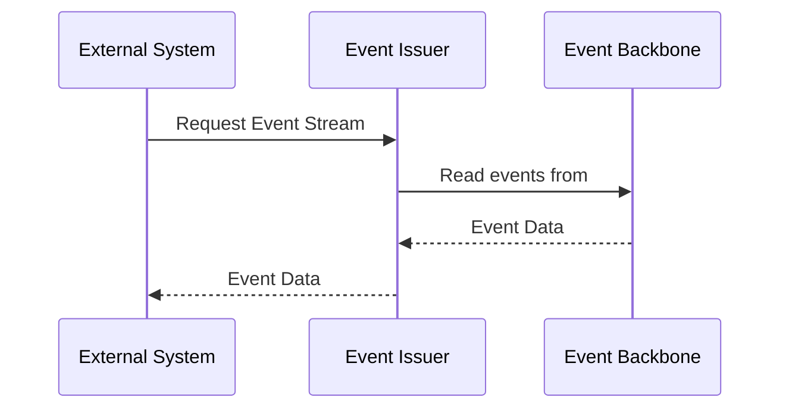

# Introduction

## What is Event Issuer?

The purpose of the event issuer is to share event data from the event backbone to systems outside of the Bane NOR network.

### Highlights

- Abstract event delivery via a <!-- secured --> [RESTful API](https://api-portal.banenor.no/)
- Enable development of event-driven applications and asynchronous microservices.
- Efficient low latency event delivery.

## How does Event Issuer work?

A good way to think of `events` is that they are like messages in a stream processing or queuing system, but have a defined structure that can be understood and validated. <!-- Event Issuer supports an event type registry API that lists all the available event types. -->

A resource called a `stream` is available for event types. The stream can be read from by one or more consumers.

Consumers can read events and track their position in the stream using a cursor. Consumers can also use a cursor to read from a stream at a particular position. Multiple consumers can read from the same stream, allowing different applications to read the stream simultaneously.

## [Getting Started](./getting-started.md)
