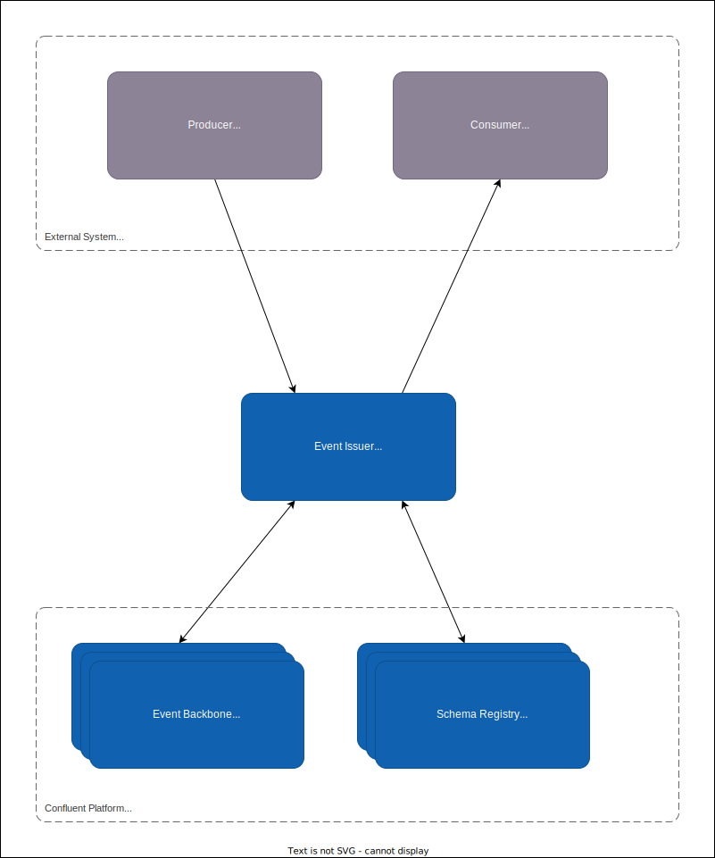

# Why Event Issuer exists

The goal of an Event Issuer is to provide an infrastructure to abstract event delivery via a secured RESTful API to external users and systems such as SaaS. This allows external users to maintain service boundaries, and not directly depend on any specific message broker technology. The event issuer will have the possibility for both consuming events from Bane NOR and produce new events.

## Consumer

The consumer side of event issuer is based on webhooks. Webhooks are the foundation of modern API development where it is an universal concept that is easily understood by many systems as a way to react to changes.

One of the main issues tough is contracts, as we should handle many different types of events, it is important to use well defined schemas/contracts that can be used for validation. For this the Event Issuer can be used to get registered schemas for the different events that can be subscribed to.

### What are Webhooks?

Webhooks are how one system notifies another system of a state change.

In architectural terms, a webhook is a programming language agnostic approach for sending messages between distributed systems. The power of webhooks comes first from being independent of any specific tech stack and second from the notification-based approach. Regardless of your architecture, your systems can receive or broadcast webhooks without being dependent on a specific vendor or even on the same network. Further, downstream systems receiving webhooks don't need to poll a central system for updates or status changes, they can simply listen for an event and process the results.

In practical terms, a webhook is simply an HTTP request - usually a POST - with a JSON payload or parameters broadcast from the central system. Much of the modern web is built on this distributed communication pattern.

## Producing

To produce events to Bane NOR the Event Issuer will have endpoints that can be used to send new events. These events must have predefined data schemas that will be registered into the schema registry. This gives the Event Issuer the ability to validate incoming events that they are in fact following the contract and do no cause any poison pill to our systems.

In Confluent a Poison Pill is defined as:

> “a record that has been produced to a Kafka topic and always fails when consumed, no matter how many times it is attempted.” — Confluent.io

## Cloudevents

> A specification for describing event data in a common way - cloudevents.io

[Cloudevents](https://cloudevents.io/) is part of the [Cloud Native Computing Foundation](https://www.cncf.io/projects/cloudevents/) list of projects. This is an specification that tries to standardize the way we describe events and its metadata/headers.

Event Issuer follows the cloudevents specification and will and uses the [HTTP protocol bindings](https://github.com/cloudevents/spec/blob/v1.0.2/cloudevents/bindings/http-protocol-binding.md) for all outgoing events. For producers this will be based on the [JSON Event Format](https://github.com/cloudevents/spec/blob/v1.0.2/cloudevents/formats/json-format.md).

For more technical specifications see the cloudevents [user guide section](./user-guides/cloudevents.md)

## Security

Event Issuer will go into some different phases around the security. Where the initial alpha versions will only work for invited partners. Tough we will work towards for consumer side to be self service for the most part, where producers needs to be controlled before they are allowed to send events.

It is also important to support different authentication and authorizations not only to Bane NOR but to the external webhooks.

Some ideas of features that will be added around this are:

- OAuth2, JWTs, and JWKs for authentication and authorization towards the webhook endpoint
- API Keys that can be configured by the end users if needed to authenticate to their webhook endpoints
- One Time Verification, seen at other systems like Twitter and Microsoft OneDrive. Use during setup to confirm that the consumer controls the code endpoint
- Event signing so that consumer can verify that the event has not been tampered with after being sendt from event issuer and gives event integrity
