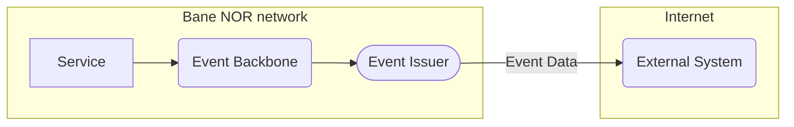

# Introduction

## Prerequisite

- [What is event-driven architecture, and what are the benefits?](https://developer.ibm.com/articles/advantages-of-an-event-driven-architecture/)

## What is Event Issuer?

Event issuer is a service designed to facilitate the sharing of events from the Bane NOR's Event Backbone to external systems.

## Why do we need an Event Issuer?

### Security

Due to security concerns, Bane NOR cannot directly expose the Event Backbone to the internet. <br/> Therefore, the Event Issuer serves as a intermediary, ensuring a secure means of delivering event data to external systems.

#### Subscribing to Event type

```mermaid
flowchart BT
    subgraph Maskinporten
        id(Identity Provider)
    end

    subgraph Internet
        external(External System)--1. Authenticate-->id
        id-. 2. Receive Token .->external
    end

    subgraph Bane NOR network
        external-- 3. Request Event subscription-->apim(API Manager)
        apim-- 4. Verify Token-->id
        id-. 5. OK .-apim
        apim-- 6. Forward request -->eventIssuer([Event Issuer])
    end
```

#### Consuming event



### Standardization

By having a standardized process for external parties to consume Bane NOR events it lowers the threshold for external parties to start consuming events from Bane NOR, regardless if it is a single developer or a big organization.

Event Issuer is also built using the HTTP protocol, which is a standardized way of exchanging data.
Making it easy to integrate and applicable for most use cases.

### Benefits

- Abstract event delivery via a <!-- secured --> [RESTful API](https://api-portal.banenor.no/)
- Enable the development of event-driven applications and asynchronous microservices.
- Provides efficient, low latency event delivery.

### Example use cases

- [TogApp](use-case-tog-app.md)

## How does Event Issuer work?

A good way to think of `events` is that they are like messages in a stream processing or queuing system, but have a defined structure that can be understood and validated. <!-- Event Issuer supports an event type registry API that lists all the available event types. -->

A resource called a `stream` is available for event types. The stream can be read from by one or more consumers.

Consumers can read events and track their position in the stream using a cursor. Consumers can also use a cursor to read from a stream at a particular position. Multiple consumers can read from the same stream, allowing different applications to read the stream simultaneously.


In short, Event Issuer exposes event streams as Webhooks

!!! note "Read more about Webhooks"
[Webhooks.fyi - Introduction](https://webhooks.fyi/)

## [Get Started](../user-guides/index.md)

## Roadmap

### Feature: Maskinporten integrasjon

In collaboration with DigDir, Bane NOR is working to develop a simplified application process for accessing Bane NOR's services through Maskinporten.

In the future, it will be possible to use this access to issue a token from Maskinporten, and use it to authenticate in Event Issuer and obtain authorization for specific event types.

<!-- Tooltips -->

*[Webhooks]: Webhooks are automated messages sent from apps when something happens.
*[Event Backbone]: The communication layer that facilitates events
