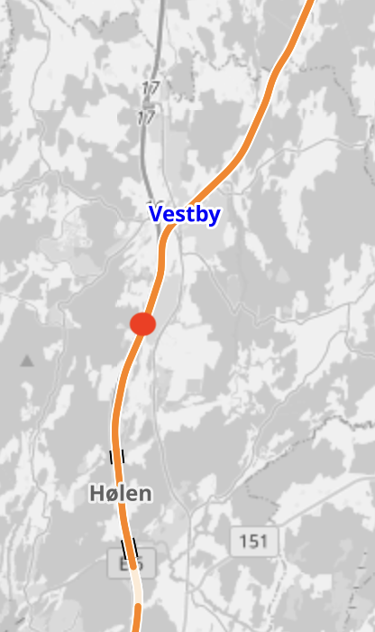
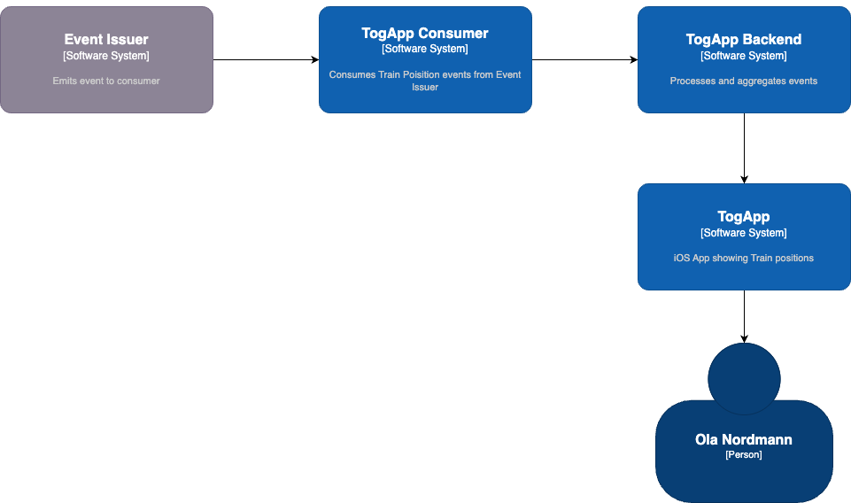

# Use case: TogApp

!!!Note
This is a hypothetical use case whose purpose is to highlight benefits of using Event Issuer

## Overview

TogApp AS, is developing an iOS application that provides users with real-time train position updates on a map. To achieve this, TogApp leverages event-driven architecture, utilizing events from Bane NOR.

{: style="height:300px"}

## System Context



### Seamless Integration

Thanks to its event-driven architecture, TogApp seamlessly integrates with Bane NOR, the provider of train position data. Bane NOR generates real-time train position events in a standardized JSON format, which acts as a contract between the two systems. TogApp can focus on its core functionality without needing to concern itself with the intricacies of Bane NOR's internal processes.

```json title="public.operational.event.train-position.json.v1 schema"
{
  "$id": "https://example.com/person.schema.json",
  "$schema": "https://json-schema.org/draft/2020-12/schema",
  "title": "TrainPosition",
  "type": "object",
  "properties": {
    "timestamp": {
      "type": "datetime",
      "description": "Timestamp of event"
    },
    "trainId": {
        "type": "number",
        "description": "Train identifier"
    },
    "latitude": {
        "type": "number",
        "description": "Latitude of train position"
    },
    "longitude": {
        "type": "number",
        "description": "Longitude of train position"
    }
  }
}
```

### Real-time updates

By subscribing to the event type **public.operational.event.train-position.json.v1**, TogApp receives real-time updates on train positions. This ensures that TogApp's users are always aware of the current locations of trains, enhancing the app's utility and user experience.

| Timestamp            | Train ID | Latitude | Longitude |
| -------------------- | -------- | -------- | --------- |
| 2023-10-24T09:12:15Z | 1        | 9.96233  | 49.80404  |
| 2023-10-24T09:12:30Z | 3        | 6.11499  | 50.76891  |
| 2023-10-24T09:12:45Z | 1        | 6.80592  | 51.53548  |

<!-- Polling -->


### Data enrichment

TogApp isn't limited to using the raw event data alone. It has the flexibility to enrich this data by aggregating it with information from other sources, such as train models and operators. This enables TogApp to provide even more valuable insights to its users, making the app an indispensable tool for train enthusiasts and commuters.

## Conclusion

TogApp's utilization of event-driven architecture leveraging events such as `public.operational.event.train-position.json.v1` from Bane NOR offers numerous benefits. It provides seamless integration with data providers, real-time updates, data enrichment opportunities, scalability, resilience, and easy access for external systems. This approach not only enhances the user experience but also positions TogApp as a versatile platform for sharing real-time train position information.
