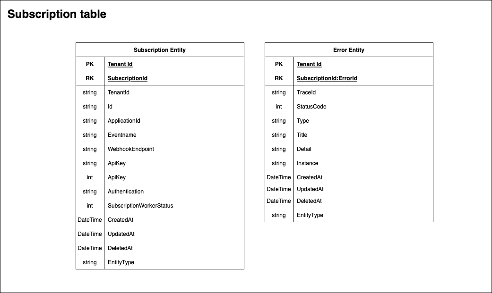
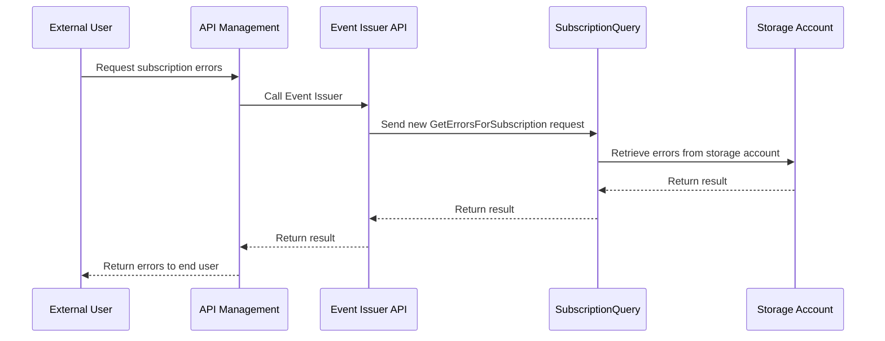
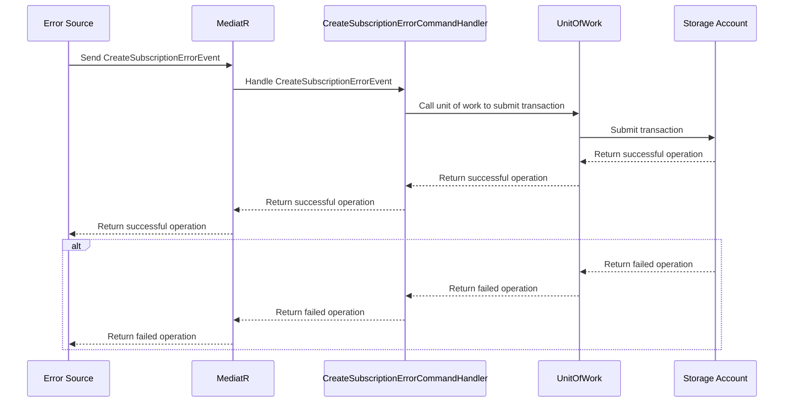

# Error reporting
With the Event Issuer Error Report feature, we want to make it easier for users to see their subscription's errors.

# Design

## Get Errors url
Errors will be presented together with a subscription, so getting errors will be the same URLs as getting subscriptions

### Specific subscription
**GET** http://{env}.api.apps.banenor.no/event-issuer/v1alpha/{tenantId}/subscriptions/{subscriptionId}

### All subscriptions within a tenant
**GET** http://{env}.api.apps.banenor.no/event-issuer/v1alpha/{tenantId}/subscriptions

## Errors in Subscription
When storing errors for an Event Issuer subscription it is stored in the same table as the Subscription, but as a seperate entity. This adheres to the [compound-key](https://learn.microsoft.com/en-us/azure/storage/tables/table-storage-design-patterns#compound-key-pattern:~:text=heterogeneous%20entity%20types-,Compound%20key%20pattern,-Use%20compound%20RowKey) pattern where one subscription can have many errors by extending the RowKey with a new unique identifier.

## User process querying for subscription errors

To retrieve a subscription with the errors, we need to modify the SubscriptionResult record to include a list of the ProblemDetails as well. 

### Event Issuer storing errors
When storing errors, the errors will source of the errors will have to implement and publish a mediatoR request of type CreateSubscriptionErrorEvent containing the error.

