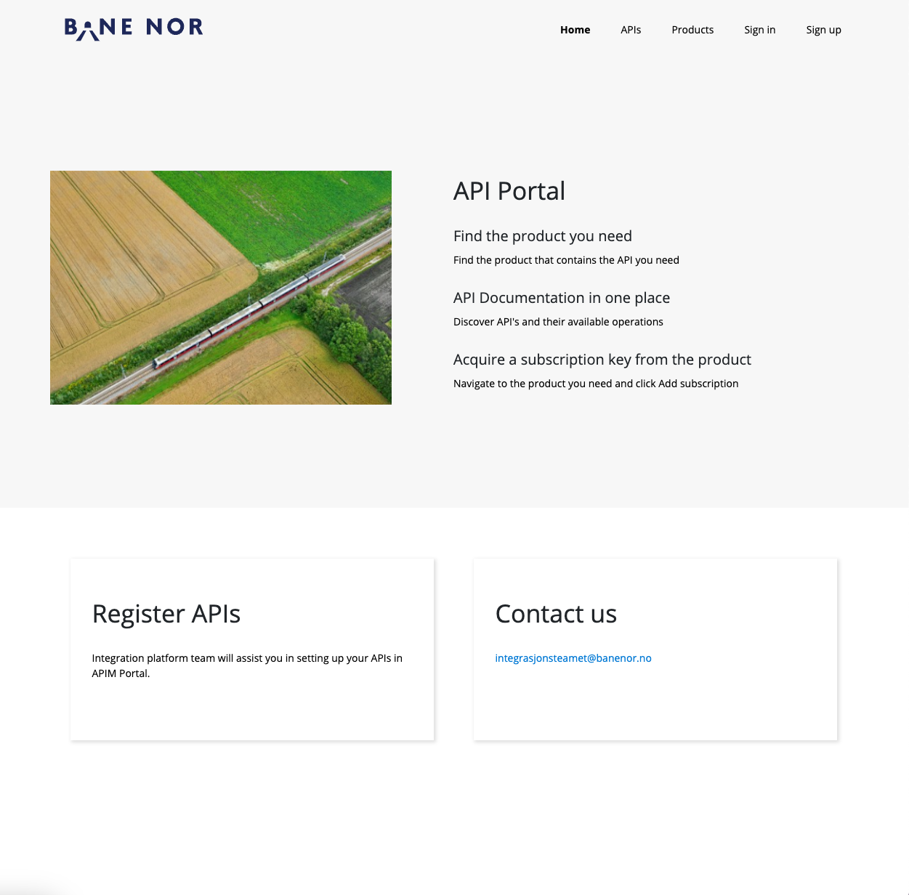
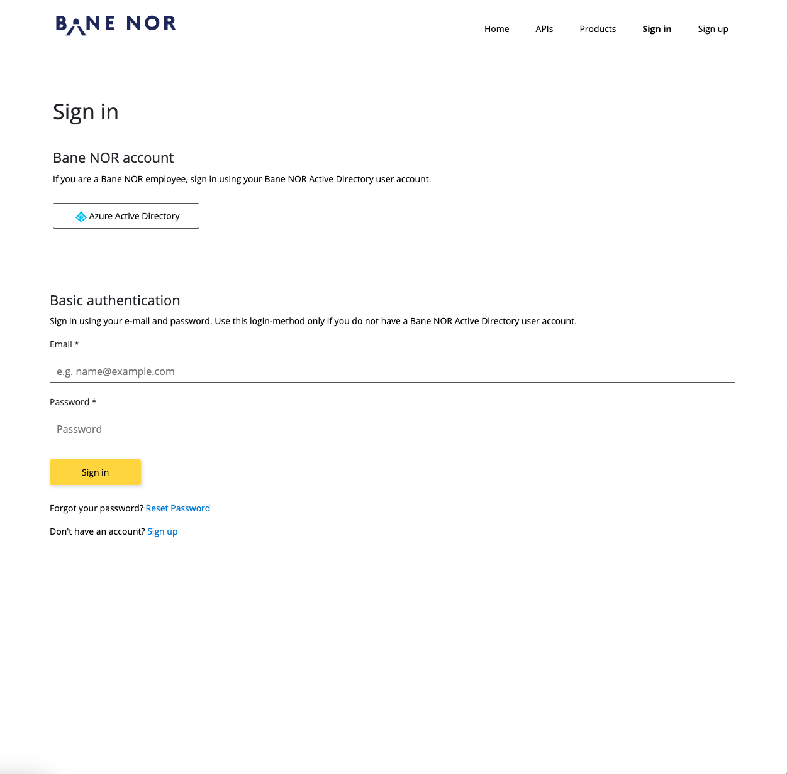
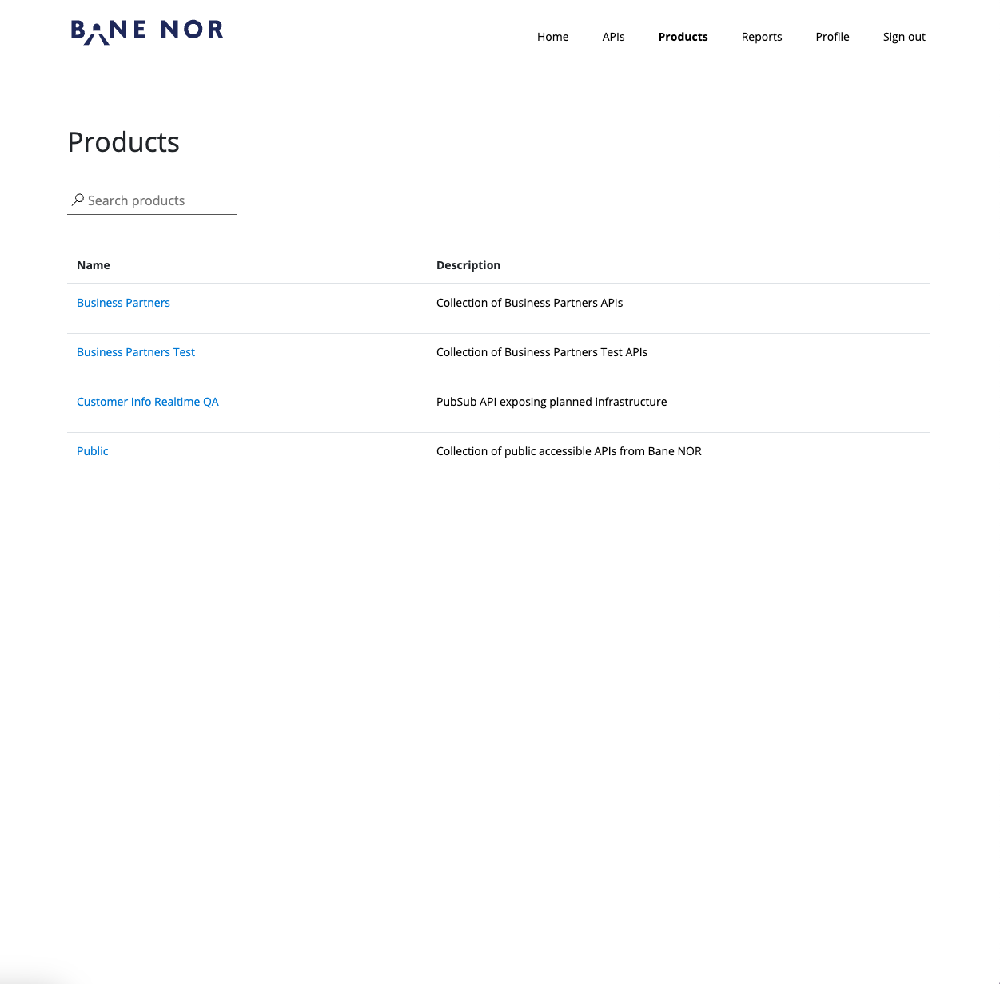
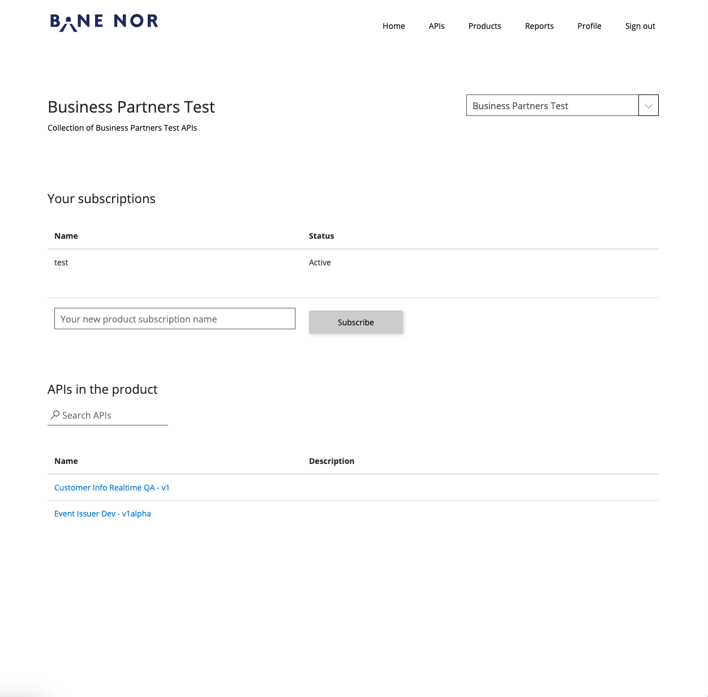
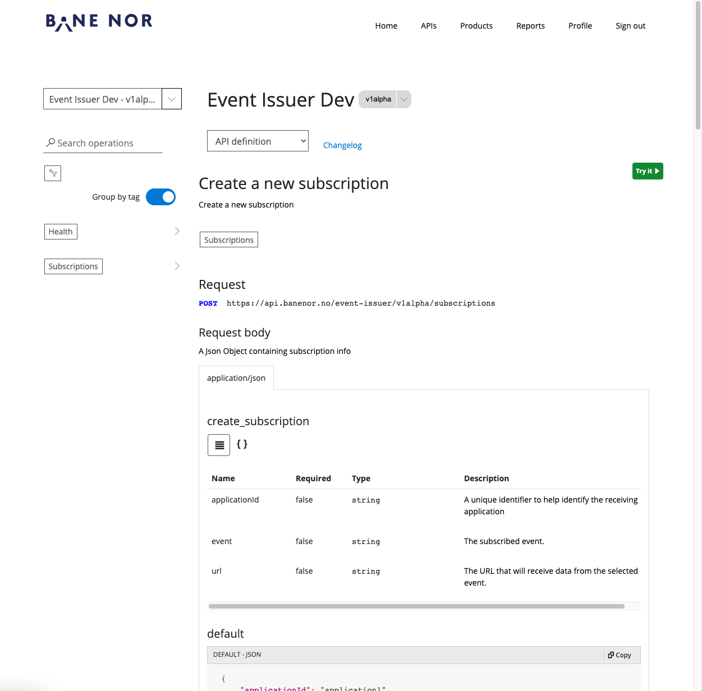

# Getting started

## How to connect to Event Issuer

The Event Issuer API is available at Bane NOR's [API Manager](https://api-portal.banenor.no/).
### 1. Go to API Manager

### 2. Sign in to API Manager

### 3. Select Business Partners Product

### 4. Subscribe to Business Partners Product


Store the subscription keys in a safe place as the keys are required to use APIs exposed through the API Manager.
### 5. Go to Event Issuer API


### 6. Connect to Event Issuer API
Now that you have the subscription keys and access to the Event Issuer API, you can start subscribing to events exposed through the Event Issuer API.

> Remember to set Ocp-Apim-SubscriptionKey in the header when using the Event Issuer API.

## How to read events from Event Issuer

Use the subscriptions endpoint to subscribe to an Event.

> POST https://api.banenor.no/event-issuer/v1alpha/subscriptions

Example Payload

```json
{
    "applicationId": "application1",
    "event": "cloud.operational.event.train-arrived-at-station.v1",
    "url": "https://test.no/test"
}
```

| Parameter     | Description                                           |
|---------------|-------------------------------------------------------|
| applicationId | Identificator of Application that subscribes to event |
| event         | Which Event type to subscribe to                      |
| url           | The endpoint to return events to                      |

If subscription is created successfully, Event Issuer will start sending events to the url given in the subscription.
The events are sent as `application/json` and contains the key and value of the Event.

```json
{
    "key": "object",
    "value": "object"
}
```

The deserialization and further consumption should be handled by the subscriber.
