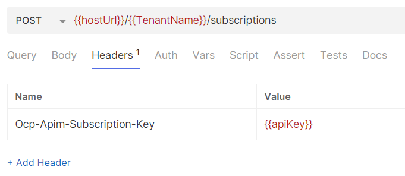
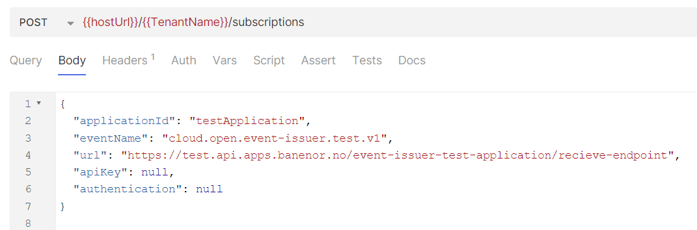
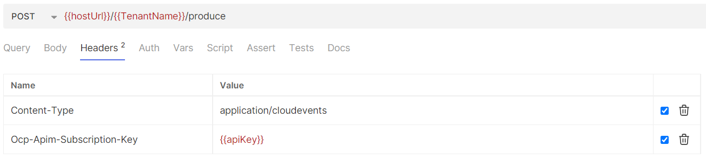
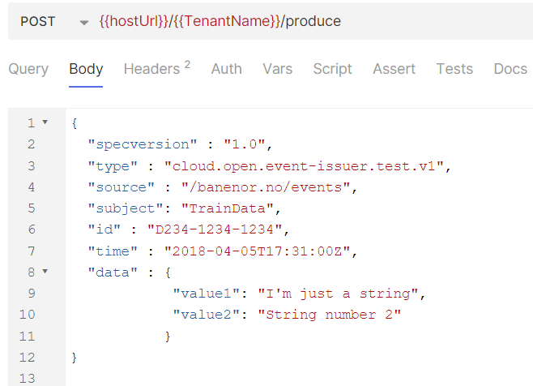

The guide contains a quick introduction to how one can get access to and start using the Event Issuer service in Bane NOR.

[TOC]

## Getting access

### Onboarding
The first step in getting access to the event-issuer service is an onboarding meeting with the integration platform. Here the goal is to map out the thought-out use case/cases for your team and why the Event Issuer would be a relevant solution. To start this onboarding process, please use our onboarding form found on the front page of our wiki which is linked here: [Integration platform front page](https://dev.azure.com/bn-apps/Integration%20platform/_wiki/wikis/Integration-platform.wiki/1692/Integration-platform)

If you are already onboarded and have been allowed to use the Event Issuer Service, the first step can be ignored.

### Get API Access
After permission has been given to use the Event Issuer service, the next step is to get API access to the event-issuer API which is available through the integration team API Management (APIM) instance. For the integration team to be able to provide you with API keys you first have to **at least once** log into the APIM developer portal relevant to the environment you want to use the Event Issuer in. Here is a list showcasing the possible environments:

- For the staging environment: [APIM Portal Staging](https://test.api-portal.apps.banenor.no )
- For the production environment: [APIM Portal Production](https://api-portal.banenor.no/)

The staging environment can be used to consume data from dev topics. The reason for this is that our dev instance will not necessarily be stable for public use and as such we will serve both dev and staging with the staging event issuer for those that need to work with their own development.

Once logged in to the developer portal for the first time, you will be visible with your e-mail address and the integration team will be able to provide you with subscription keys.

## Using Event Issuer
As mentioned in the getting access chapter of this document, the Event Issuer is available through an API present in each environment instance of APIM meaning that all available endpoints and their descriptions can be seen there. The API documentation is also available on GitHub using Redocly rendering which can be easier to read. The document can be seen here: [GitHub version of API](https://bane-nor.github.io/event-issuer/apis/v1/)

This means that if you prefer, you can simply test sending API requests using for example [Bruno](https://www.usebruno.com/) based on the API documentation. Otherwise, here is a showcase of some Bruno requests that can help you get started with links to relevant repositories.

### Starting your first subscription
Once your user has gotten access to the event-issuer API, and a tenant for your organization has been created with the correct access policies, you can create your first subscription. To create a subscription, you must use the **Create Subscription** method towards the event-issuers subscription Endpoint. The API definition for this can be seen on the available API found in our GitHub documentation here: [Create Subscription Method](https://bane-nor.github.io/event-issuer/apis/v1/redoc-ebfe90c5.html#tag/Subscriptions/operation/createSubscription)

#### Example Bruno Request
An example request for this method can be found in our [event issuer repository](https://github.com/Bane-NOR/event-issuer?tab=readme-ov-file) in our bruno folder or seen in the figure below using the [Bruno](https://www.usebruno.com/) API client:
##### Header
The only required header per writing is the API key for the event-issuer API found on your account in the developer portal

##### Body
The content of the request are just for examples. For more concrete information on all subscription body options. Check out the [subscriptions page](/docs/user-guides/subscriptions.md)
 

### Producing your first message
Once your user has gotten access to the event-issuer API, and a tenant for your organization has been created with the correct access policies, you can produce your first message towards the Bane NOR Event Backbone which as per writing is Confluent Kafka. To produce a message, you must use either the **Produce Cloud Event** method or **Produce batch of Cloud Events**  method found under the produce endpoint. The API definition for this can be seen on the available API found in our GitHub documentation here: [Produce Cloud Event Method](https://bane-nor.github.io/event-issuer/apis/v1/redoc-ebfe90c5.html#tag/Produce/operation/produce)

#### Example Bruno Request
An example request for this method can be found in our [event issuer repository](https://github.com/Bane-NOR/event-issuer?tab=readme-ov-file) in the bruno folder or seen in the figure below using the [Bruno](https://www.usebruno.com/) API client:

##### Header
The only required header per writing is the API key for the event-issuer API found on your account in the developer portal

##### Body
The content of the request are just for examples
