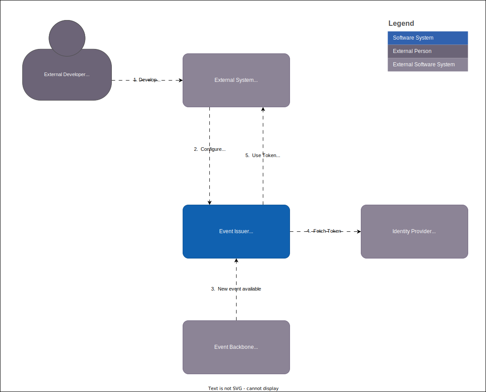

# Subscriptions

Subscriptions is the main mechanism for getting realtime events from the Bane NOR event backbone. The subscription is an reference to an application that wants events to be sendt to an webhook endpoint. The subscriber can configure the authentication towards the endpoint in addition to an API key if that is needed.

## Webhook endpoint

The endpoint will receive the event payload with additional metadata by using the [CloudEvents](cloudevents.md) HTTP binding.

The following header values will be found as part of the request:

```text
ce-specversion: 1.0
ce-type: no.banenor.event-type
ce-id: <unique-id>
ce-source: <source identification of the event>
ce-time: 2024-01-05T03:56:24Z
ce-datacontenttype: application/json
```

!!! info
    As event issuer is under development this can change and/or some are missing. Event Issuer is also dependent on publishers using cloud events as not all are using them at the moment.

## Authenticating subscriptions

Some users require authentication and authorization to be able to communicate with their APIs. For this purpose different types can be configured for the subscription. The following are supported:

- No authentication
- [API Key](https://swagger.io/docs/specification/authentication/api-keys/)
- [Basicauth](https://swagger.io/docs/specification/authentication/basic-authentication/)
- [OAuth 2.0](https://swagger.io/docs/specification/authentication/oauth2/)

The idea is that the end users or services can configure this the needed information to authenticate towards the webhook endpoint and update the configuration as needed.

The API Key can be configured with any of the other options in case it is needed as part of your API management setup.

### API Key

API Key is something that usualy are created when subscribint to certain API or products that can be used both as an token for an API Management system to check if the request should be handeled and in monitoring siuations to check the number of requests are used.

Event Issuer supports the use of an API Key configuration wich can be configured with one of the other autentication mechanisms if both are needed.

### Basic Auth

Basic authentication with an username and password is supported as an simple mechanism for getting access to an webhook.

### Identity Providers

An [identity provider (IdP)](https://en.wikipedia.org/wiki/Identity_provider) is a system that creates, stores, and manages digital identities. The IdP can either directly authenticate the user or can provide authentication services to third-party service providers (apps, websites, or other digital services).

The following IdPs are supported by to fetch OAuth2.0 tokens:

- [Maskinporten](https://www.digdir.no/felleslosninger/maskinporten/869)
- [Entra ID](https://learn.microsoft.com/en-us/entra/fundamentals/whatis)

The following diagram shows the system-context for the communication with and IdP.



#### Maskinporten

[Maskinporten](https://www.digdir.no/felleslosninger/maskinporten/869) is a Norwegian solution to add authorisations between companies that needs to be able to share data between systems or in other words machine-to-machine. For using maskinporten

Maskinporten uses the [JWT Grant mechanisms](https://datatracker.ietf.org/doc/html/rfc7523) to obtain the `access_token` used towards the Webhook endpoint configured. The following is the configuration options for Maskinporten:

``` json
{
    "clientId": "<the-client-id>",
    "scopes": "<whitespace separated list of scopes",
    "reSource": "<the target API that the client intends to use the token",
    "pid": "<The target end-user that the client intends to do subsequent API-calls on>",
    "consumerOrg": "<String value carrying the Norwegian organization number of the legal consumer the client wants to get a token for>",
    "iss_onbehalfof": ""
}
```

[`reSource`](https://docs.digdir.no/docs/Maskinporten/maskinporten_func_audience_restricted_tokens) is optional if the API endpoints needs it together with [`pid`](https://docs.digdir.no/docs/Maskinporten/maskinporten_func_pid_restricted_tokens.html).

#### Entra Id

Entra Id is the standard OAuth authentication mechanism used in Azure. To be able to use this with Event Issuer subscriptions, we will need to do a server-to-server interaction that runs in the background, without immediate interaction with a user. This is done through an OAuth client-credential flow that grants permissions directly to the application itself by an administrator.

##### Client credentials flow

This diagram describes how authentication works between background services. For Event-Issuer the flow would look like this.

**This flow assumes that an admin has created an app registration for the subscription given it the correct permissions to the Web API in questions.**


##### Access control

Microsoft provides two options to grant access to applications: **access control lists** and **application permissions**.

###### Access control lists

Access control lists enforce autorization based on a list of applicaiton IDs that it knows and grants a specific level of access to. When the relevant resource receives a token, it decodes it and checks it against the list of authorized clients.

###### Application permissions

For data owned by organizations, Microsoft recommends using application permissions. To use application roles with your own API, you need to expose the app roles in the API's app registration, then configure the required roles in your client's (the subscription) app registration. The user who creates a subscription will also have to create an app registration in their organization that they provide the neccessary permissions.

## Create Subscription

To create an subscription the following command can be used to create an subscription that needs to use an api key and basic authentication.

```curl
curl -H "Ocp-Apim-Subscription-Key: ApiKey" https://<bane-nor-api-endpoint>/event-issuer/v1alpha/{tenantId}/subscriptions -d '{"applicationId": "my-applicaiotn", "event": "event-name", "url": "https://my-endpoint.com/events}, "apiKey": { "header": "Ocp-Apim-Subscription-Key", "key": "api-key" }, "authentication": { "username": "user1", "password": "my-secure-password" }'
```

If only an api key is needed don't set the `authentication` and and only the `apiKey` section.
