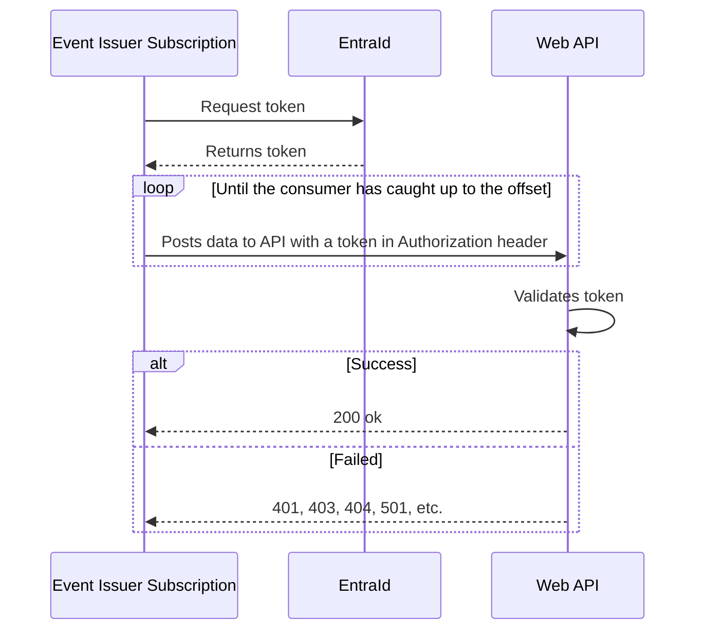

!!! warning under construction
 The following section is under construction

# Subscriptions

Subscriptions are the main mechanism for getting real-time events from the Bane NOR event backbone. The subscription is a reference to an application that wants events to be sent to a webhook endpoint. The subscriber can configure the authentication towards the endpoint in addition to an API key if that is needed.

## Webhook endpoint

The endpoint can receive the event payload with additional metadata by using the [CloudEvents](cloudevents.md) HTTP binding.

Cloud events are sent by using the [HTTP Protocol Binding](https://github.com/cloudevents/spec/blob/v1.0.2/cloudevents/bindings/http-protocol-binding.md). This means that the CloudEvents are part of the HTTP headers.

!!! info
Bane NOR is working on standardizing event messages around the cloud event specification which means that some event types might be missing from the cloud event headers.

## Authenticating subscriptions

Some users require authentication and authorization to be able to communicate with their APIs. For this purpose, different types can be configured for the subscription. The following are supported:

- No authentication
- [API Key](https://swagger.io/docs/specification/authentication/api-keys/)
- [Basicauth](https://swagger.io/docs/specification/authentication/basic-authentication/)
- [OAuth 2.0](https://swagger.io/docs/specification/authentication/oauth2/)

The idea is that the end users or services can configure the needed information to authenticate towards the webhook endpoint and update the configuration as needed.

### API Key

API Key is something that is created when subscribing to certain APIs or products. The key can be used both as a token for an API Management system to check if and how the request should be handled, and in monitoring situations to check that the number of requests is within for example rate limits set by the API owner.

Event Issuer supports the use of an API Key configuration which can be configured with one of the other authentication mechanisms if both are needed.

### Basic Auth

Basic authentication with a username and password is supported as a simple mechanism for getting access to a webhook.

#### Example

```json
{
    "applicationId": "application1",
    "eventName": "cloud.operational.train-arrived-at-station.v1",
    "url": "https://test.no/test",
    "apiKey": {
        "header": "Ocp-Apim-Subscription-Key",
        "key": "jnfdi923r8fnaszy12orf98032nrcn7u982"
 },
    "authentication": {
        "type": "basic",
        "username": "systemx",
        "password": "use-a-secure-password"
 }
}
```

### Identity Providers

An [identity provider (IdP)](https://en.wikipedia.org/wiki/Identity_provider) is a system that creates, stores and manages digital identities. The IdP can either directly authenticate the user or can provide authentication services to third-party service providers (apps, websites, or other digital services).

The following IdPs are supported for fetching OAuth2.0 tokens:

- [Maskinporten](https://www.digdir.no/felleslosninger/maskinporten/869)
- [Entra ID](https://learn.microsoft.com/en-us/entra/fundamentals/whatis)

The following diagram shows the system context for communication with an IdP.


#### Maskinporten

[Maskinporten](https://www.digdir.no/felleslosninger/maskinporten/869) is a Norwegian solution to add authorizations between companies that need to be able to share data between systems or in other words machine-to-machine.

##### Example

```json
{
    "applicationId": "application1",
    "eventName": "cloud.operational.train-arrived-at-station.v1",
    "url": "https://test.no/test",
    "apiKey": {
        "header": "Ocp-Apim-Subscription-Key",
        "key": "jnfdi923r8fnaszy12orf98032nrcn7u982"
 },
    "authentication": {
        "type": "maskinporten",
        "scopes": [ "company:apix:write" ]
}
```

!!! info
 To be able to use Maskinporten the integration team at Bane NOR needs to be contacted to link the Maskinporten integration to be able to use the correct scope from the API vendor.

For companies that use a [token exchange](https://datatracker.ietf.org/doc/html/rfc8693) where the Maskinporten token needs to be exchanged with a company-specific token, contact the integration team with the specific needs. This will then be added to the backlog and implemented as a tenant-specific solution for those needs.

#### Entra ID

[Entra ID](https://learn.microsoft.com/en-us/entra/fundamentals/whatis) is the standard OAuth authentication mechanism used in Azure. To be able to use this with Event Issuer subscriptions, we will need to do a server-to-server interaction that runs in the background, without immediate interaction with a user. This is done through an OAuth client-credential flow that grants permissions directly to the application itself by an administrator.

Entra Id also uses the [JWT Grant mechanisms](https://datatracker.ietf.org/doc/html/rfc7523) to obtain the `access_token` for requests. These are the configuration options for Entra.
``` json
// With client secret
{
    "AuthUrl": "https://login.microsoftonline.com/",
    "TenantId": "[Enter here the tenantID or domain name for your Azure AD tenant]",
    "ClientId": "[Enter here the ClientId for your application]",
    "ClientSecret": "string",
    "scope": "string",
    "grant_type": "client_credentials"
}
```

``` json
// With a certificate or federated credential
{
    "AuthUrl": "https://login.microsoftonline.com/",
    "TenantId": "[Enter here the tenantID or domain name for your Azure AD tenant]",
    "ClientId": "[Enter here the ClientId for your application]",
    "client_assertion_type": "The value must be set to urn:ietf:params:oauth:client-assertion-type:jwt-bearer.",
    "client_assertion": "JSON web token needed to sign with the certificate",
    "scope": "string",
    "grant_type": "client_credentials"
}
```

##### Example

```json
{
    "applicationId": "application1",
    "eventName": "cloud.operational.train-arrived-at-station.v1",
    "url": "https://test.no/test",
    "apiKey": {
        "header": "Ocp-Apim-Subscription-Key",
        "key": "jnfdi923r8fnaszy12orf98032nrcn7u982"
 },
    "authentication": {
        "type": "entraid",
        "url": "https://login.microsoftonline.com/{tenantId}/oauth2/v2.0/token",
        "clientId": "d0a3da30-8936-4800-9c23-37c1b86d8a63",
        "clientSecret": "7hzQ3bPSNThb7Cgem+a+w2RqLMKr*LqCSALYco-zQyi4ueUnVo",
        "scopes": [ "apix:write" ]
}
```

##### Client credentials flow

This diagram describes how authentication works between background services. For Event-Issuer the flow would look like this.

**This flow assumes that an admin has created an app registration for the subscription and given it the correct permissions to the Web API in question.**



##### Access control

Microsoft provides two options to grant access to applications: **access control lists** and **application permissions**.

###### Access control lists

Access control lists enforce authorization based on a list of application IDs that it knows and grants a specific level of access to. When the relevant resource receives a token, it decodes it and checks it against the list of authorized clients.

###### Application permissions

For data owned by organizations, Microsoft recommends using application permissions. To use application roles with your API, you need to expose the app roles in the API's app registration, and then configure the required roles in your client's (the subscription) app registration. The user who creates a subscription will also have to create an app registration in their organization that they provide the necessary permissions.

## Create Subscription

The following command can be used to create a subscription that uses an API key and basic authentication.

```curl
curl -H "Ocp-Apim-Subscription-Key: ApiKey" https://<bane-nor-api-endpoint>/event-issuer/v1alpha/{tenantId}/subscriptions -d '{"applicationId": "my-application", "event": "event-name", "URL": "https://my-endpoint.com/events}, "apiKey": { "header": "Ocp-Apim-Subscription-Key", "key": "API-key" }, "authentication": { "username": "user1", "password": "my-secure-password" }'
```

If only an API key is needed don't set the `authentication` and and only the `apiKey` section.
